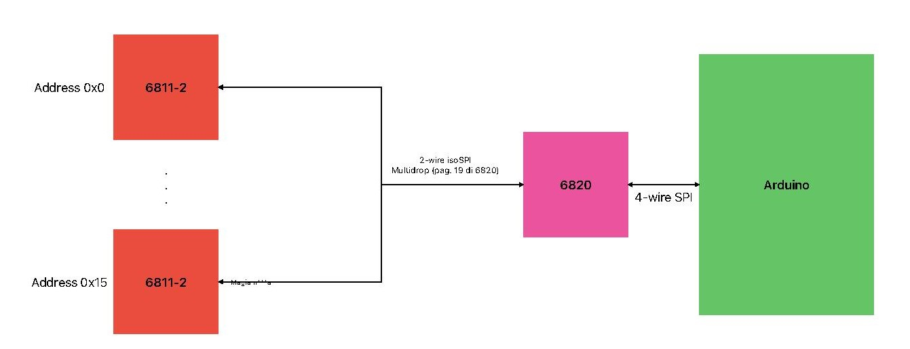
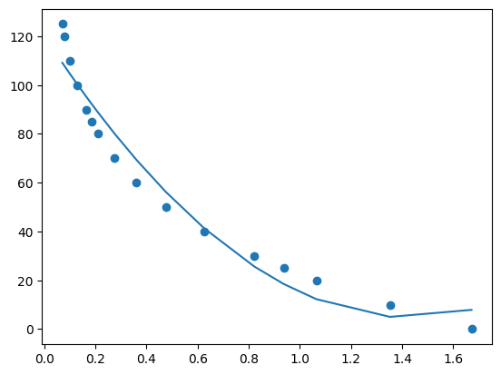
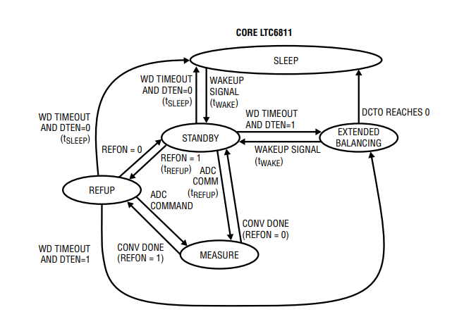

# BMS host RaceUP SG-06

Questa repository contiene il codice per l'host del BMS basato su Arduino 2. 

## Table of contents
- [Come funziona](#come-funziona)
    - [Processo](#processo)
- [Invio e ricezione](#invio-e-ricezione)
    - [Command format](#command-format)
        - [CMD0 CMD1](#cmd0-cmd1)
        - [PEC0 PEC1](#pec0-pec1)
        - [Command code](#cc)
- [Codice](#codice)
    - [Configurazione](#configurazione)
    - [Stato](#stato)
    - [Comandi](#comandi)
    - [Timer](#timer)
- [Sviluppo](#sviluppo)

## Come funziona

Il BMS (Battery Managment System) è il software che permette la lettura della temperatura, tensione e altri dati significati dai 16 slave. Ogni slave legge i valori da 18 celle (9 parallelo) per un totale di 288.  

### Processo
Il BMS si compone di un Arduino 2 (vedi sezione [Sviluppo](#sviluppo)) che, tramite 4-wire SPI, comunica con un modulo [LTC-6820](https://www.analog.com/media/en/technical-documentation/data-sheets/LTC6820.pdf) a cui invia l'indirizzo dello slave con cui vuole comunicare e il comando che si desidera eseguire. 

Il 6820 in configurazione "multidrop" si connette a tutti gli slave in parallelo comunicando tramite 2-wire isoSPI con gli [LTC-6811-2](https://www.analog.com/media/en/technical-documentation/data-sheets/LTC6811-1-6811-2.pdf) montati su ognuno di questi e, grazie all'uso di qualche magia n*gra, riesce ad individuare e ricevere i dati dallo slave desiderato. 



## Invio e ricezione
Come detto in precedenza, per ricevere i dati da un determinato slave è necessario inviare al 6820 l'indirizzo di questo e il comando da eseguire.

### Command format
Il formato dei comandi da inviare all'LTC è il seguente:

|   8  	|   8  	|   8  	|   8  	|       8       	|     	|        8       	|   8  	|   8  	|
|:----:	|:----:	|:----:	|:----:	|:-------------:	|:---:	|:--------------:	|:----:	|:----:	|
| CMD0 	| CMD1 	| PEC0 	| PEC1 	| Data Byte Low* 	| ... 	| Data Byte High* 	| PEC0* 	| PEC1* 	|

La notazione è in big endian ⚠️  

Il primo PEC viene calcolato sul comando inviato e il secondo sul payload

#### CMD0 CMD1
CMD0 e CMD1 sono formattati nel seguente modo:

| Name 	| RD/WR 	|  BIT7 	|  BIT6 	|  BIT5 	|  BIT4 	|  BIT3 	|  BIT2  	|  BIT1 	|  BIT0 	|
|:----:	|:-----:	|:-----:	|:-----:	|:-----:	|:-----:	|:-----:	|:------:	|:-----:	|:-----:	|
| CMD0 	|   WR  	|   1   	|  a3*  	|  a2*  	|  a1*  	|  a0*  	| CC[10] 	| CC[9] 	| CC[8] 	|
| CMD1 	|   WR  	| CC[7] 	| CC[6] 	| CC[5] 	| CC[4] 	| CC[3] 	|  CC[2] 	| CC[1] 	| CC[0] 	|

Dove ax* è l'indirizzo in binario dello slave, e CC[x] è il comando.

#### PEC0 PEC1
Il PEC (Packet Error Code) è un [CRC](https://it.wikipedia.org/wiki/Cyclic_redundancy_check) di 15 bit. Nel datasheet è presente la funziona già implementata che noi, per non saper nè leggere nè scrivere, copiamo e incolliamo. 

#### CC
La tabella 38 (6811) fornisce tutti i comandi possibile.  
LTC6811 è diviso in 4 gruppi di registri:

|   Name  	| Cell1 	| Cell2 	| Cell3 	|
|:-------:	|:-----:	|:-----:	|:-----:	|
| Group A 	|   1   	|   2   	|   3   	|
| Group B 	|   4   	|   5   	|   6   	|
| Group C 	|   7   	|   8   	|   9   	|
| Group D 	|   10  	|   11  	|   12  	|

Noi utilizzeremo solo fino al gruppo C.

## Codice
### Configurazione
La configurazione viene scritta con il comando `WRCFGA` (write configuration register A) e viene letta con il comando `RDCFGA` (read configuration register A). Vedi tabella 40 (6811).  

### Stato
I registri di stato considerevoli sono:

- Group A: 
    - `SC` (somma voltaggi delle celle), primi 2 byte
- Group B
    - `C[N]OV`, flag di overvoltage della cella [N], i-esimo bit dispari
    - `C[N]UV`, flag di undervoltage della cella [N], i-esimo bit pari

La notazione è in big endian ⚠️

### Comandi
`ADCVSC` legge le tensioni dagli ADC salvandole nei _Cell Voltage Register Group n_, inoltre salva la tensione totale nei primi 2 byte del _Status register Group A_.  

`RDCV[N]` invia la richiesta di trasmissione del contenuto dei registri del gruppo [N].  

`RDSTATA` invia la richiesta di trasmissione del contenuto dei registri di status del gruppo A.  

`ADAX` salva il valore dei GPIO (temperature) nei registri _Auxiliary Register Group A_ (GPIO 1-3) e _B_ (GPIO 4, 5)  
Il valore che viene misurato è la tensione su un [termistore](schematics/P9-JT-Thermistor-1621687.pdf). La curva di conversione è modellata partendo dai dati della tabella "Resistance/temperature" presente nel datasheet attraverso un fit polinomiale di grado 2.  
Gli errori introdotti sono visibili nel grafico:  


### Timer


Quando watchdog timer va in timout (2 secondi di inattività):  

- Discharge timer non impostato: la scheda va in sleep
- Discharge timer impostato:
    - non scaduto: la scheda va in extended balancing e scarica le celle secondo i PWM impostati
    - scaduto: la scheda va in sleep

Quando la scheda va in sleep la configurazione `CFGA` viene resettato e va re-inizializzato al prossimo comando.

### Creazione applicazione

Per produrre un eseguibile (solo per la piattaforma in uso) installare PyPackage:
```
pip3 install pypackage
```

Poi eseguire il seguente comando:
```
pyinstaller -F -w -i resources/icon.png --workpath guibuild --distpath guidist --collect-all customtkinter -n BMS .\gui\UI.py
```

L'eseguibile si troverà nella directory _guidist_